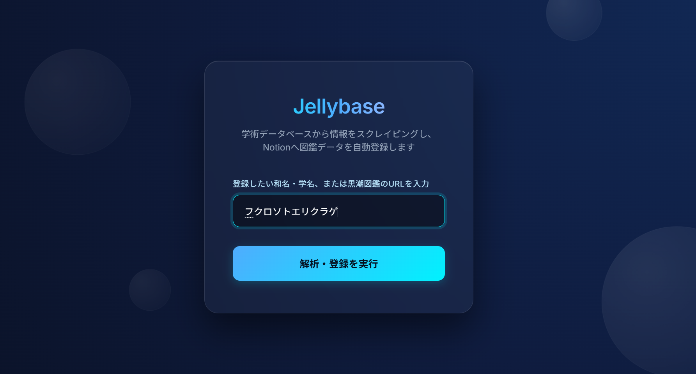

# Jellybase (生物種マスター 自動登録システム)

**Jellybase** は、Google Apps Script (GAS) と Notion API を連携させ、海洋生物（特にクラゲ）の情報を学術データベースから自動でスクレイピング・整理し、Notion上のデータベースへ図鑑データとして登録する自動化ツールです。



## 主な機能と特徴
- **複数の入力方式に柔軟に対応**: 
  - 生物の和名や学名を直接入力
  - 「黒潮Web生物図鑑」のURLを直接入力
- **学術DBスクレイピングによる高精度データ収集**: 
  - **[黒潮生物研究所 Web図鑑](https://kuroshio.or.jp/)**: 日本国内での和名や特徴的な解説文を取得します。
  - **[WoRMS (World Register of Marine Species)](https://www.marinespecies.org/) API**: 最新の分類学的系統（界から種まで）および原著論文へのリンク情報を取得し、和名検索ができない場合の代替検索にもフォールバック機能として対応しています。
  - **[BISMaL](https://www.godac.jamstec.go.jp/bismal/j/)**: WoRMSで網羅しきれない日本近海における正式な和名などの階層情報を補完・取得します。
- **Notion へのダイレクト出力**: 取得した情報を独自にMarkdown形式からNotion Block形式へパースし、手作業不要で綺麗なNotionページとして構築します。

## 構成・技術スタック
- **フロントエンド**: HTML / CSS (Glassmorphism & モダンUI) / Vanilla JS 
- **バックエンド**: Google Apps Script (`Code.js`)
- **API・外部連携**:
  - `clasp` (GAS連携)
  - Notion API

## セットアップ手順

1. 本リポジトリをローカルへクローンします。
2. 開発環境に [`clasp`](https://github.com/google/clasp) がインストールされていない場合は、npm経由でインストール・ログインします（`npm i -g @google/clasp` / `clasp login`）。
3. GASプロジェクトを作成し、紐づけるためにローカルで以下を実行します。
   ```bash
   clasp create --type standalone
   # または既存のGASのスクリプトIDがある場合は
   clasp setting scriptId [独自のGASプロジェクトID]
   ```
   ※本リポジトリでは個人の環境依存となる `.clasp.json` はGitの追跡対象から外されています。
4. `Code.js` を稼働させるため、GASエディタ上の「プロジェクトの設定」→「スクリプト プロパティ」に以下の環境変数を登録します。
    - `NOTION_API_KEY`: 作成したNotionインテグレーションのシークレットトークン
    - `NOTION_DATABASE_ID`: 登録先となるNotionデータベースのID文字列
5. 本プロジェクトをデプロイします。
   ```bash
   clasp push
   ```
6. コマンド完了後、GASエディタにて「デプロイ」>「新しいデプロイ」から「ウェブアプリ」としてデプロイを行うことで、システムのURLが発行されます。

## ライセンス・注意事項
当システムは無保証で自由に改変利用可能ですが、対象ウェブサイトのスクレイピング規約やAPI利用制限（WoRMS REST/Webサービス等）に配慮・留意の上でご利用ください。

## 開発について
本システムのコード構築および設計にあたっては、AIアシスタント（Google Gemini および Antigravity）を活用しています。
なお、AIによって生成されたコード群はすべて、開発者自身による動作テスト、仕様確認、およびレビューチェックを経た上で採用・構成されています。
